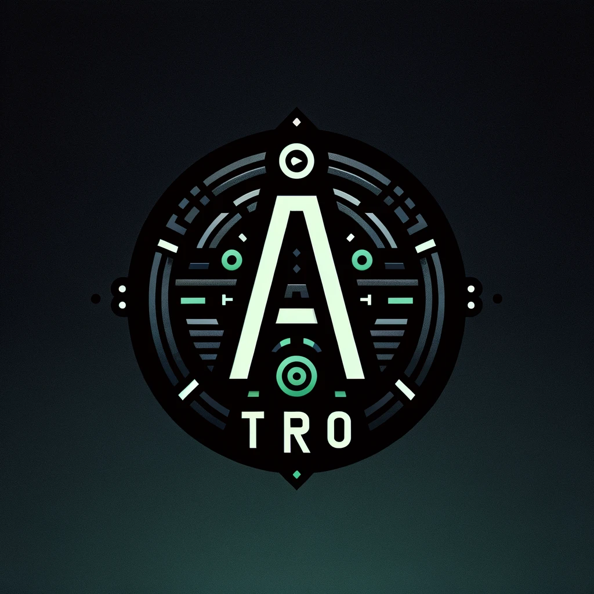

# My NeoVim Setup

<p align="center">
  
</p>

## Introduction

This is my neovim config. It is a work in progress and I am constantly updating it. It uses lua exclusively, it has lsp's , linters, formatters (which format on save) and many other comforts of life. Its still somewhat messy an inconsistent however.

## Instructions

Git clone this repo so that it sits at `~/.config/nvim`,

```bash
git clone https://github.com/atropos112/nvim.git ~/.config/nvim
```

this should work on any linux distro, and on Mac, I suspect also on WSL but I have not tried.

Once you have done this you will also need to install neovim, figure this out yourself its very OS dependent. Having this it should hopefully just work, I am low-key worried I have created un-intentional dependency on rust/go but heyho.

## Useful links

[Events for auto-cmds](https://tech.saigonist.com/b/code/list-all-vim-script-events.html)
